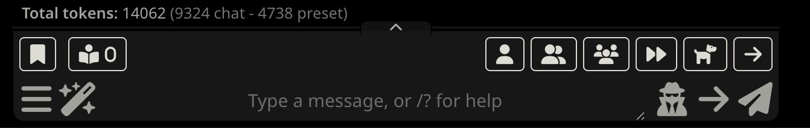

# Chat Token Counter

Disclaimer: This plugin is made a 100% by Claude. I can't code.

A minimal [SillyTavern](https://github.com/SillyTavern/SillyTavern) extension that displays the total token count of the current chat, always visible just above the message input.



## Features

- Shows total tokens across all messages in the current chat
- Uses your active tokenizer for accurate counts
- Updates automatically on send, receive, edit, delete, swipe, and chat switch
- Lightweight — single debounced recount, no settings, no dependencies

## Installation

1. Open SillyTavern and go to **Extensions** > **Install Extension**
2. Paste this URL:
   ```
   https://github.com/diamond-shark-art/st_token_counter
   ```
3. Click **Install** and reload the page

Or clone manually:

```bash
cd SillyTavern/public/scripts/extensions/third-party
git clone https://github.com/diamond-shark-art/st_token_counter
```

## Usage

Open any chat. A **"Chat tokens: N"** label appears at the bottom of the screen, just above the message textarea. The count updates automatically as you chat.
